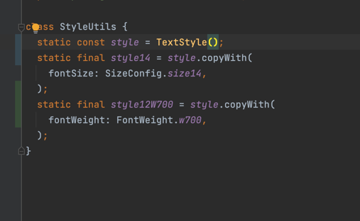

# base_flutter_bloc

A new Flutter application.

## Getting Started

This project is a starting point for a Flutter application.

A few resources to get you started if this is your first Flutter project:

- [Lab: Write your first Flutter app](https://flutter.dev/docs/get-started/codelab)
- [Cookbook: Useful Flutter samples](https://flutter.dev/docs/cookbook)

### generate file

- flutter packages pub run build_runner build --delete-conflicting-outputs

### release apk

- flutter build apk --flavor dev -t lib/main_dev.dart

## Base project support:

### Show loading dialog

#### show loading dialog:

- invoke method showLoading() inside Cubit

#### hide loading dialog:

- invoke method hideLoading() inside Cubit

#### can custom loading dialog for app by calling function:

- BaseBlocConfig.instance.configLoadingWidget((){ return Widget })

### Show common message:

#### show loading dialog:

- invoke method showMessage(String message, {MessageType type = MessageType.success}) inside Cubit

#### can custom message for app by calling function:

- BaseBlocConfig.instance.configMessageWidget((messageModel){return Widget})

#### Navigate to other screen:

- invoke method changeScreen(String routeName, dynamic data) inside cubit

## NavigationUtils

#### can navigate to other screen without care context

- Using as Navigator.of(context) (ex: Navigator.of(context).pushNamed() =>
  NavigatorUtils.instance.pushNamed())
- config route in class CommonPage with RouteModel

## Multiple language using easy_localization

- "language".tr()
## Class SizeConfig define common size is used in app
- SizedBox(width: SizedConfig.size16)
## Class StyleUtils define common Style is used in app
